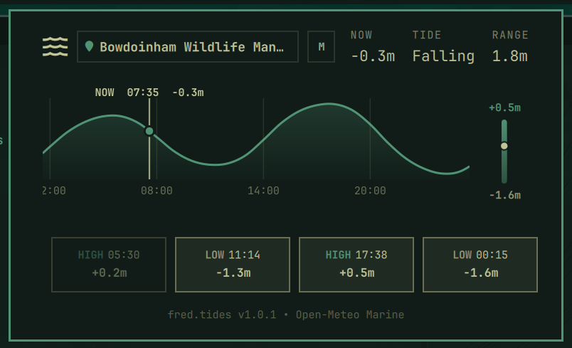

# fred.tides (`omarchy-fred-tides`)

A security-hardened, multi-monitor tide bar widget and interactive 24-hour curve panel for Tamlinux, designed to sit directly adjacent to `fred.weather` on the bar. Displays current sea level height, rising/falling status, today's tidal range, upcoming highs and lows, and a scrubbable Catmull-Rom tidal curve.



| Attribute | Detail |
| :-- | :-- |
| **Plugin ID** | `fred.tides` |
| **Version** | `1.0.4` (unreleased security fix) |
| **Version Tags** | [`v1.0.3`](https://github.com/greenermoose/tides-fred-tamlinux/releases/tag/v1.0.3), [`v1.0.2`](https://github.com/greenermoose/tides-fred-tamlinux/releases/tag/v1.0.2), [`v1.0.1`](https://github.com/greenermoose/tides-fred-tamlinux/releases/tag/v1.0.1), [`v1.0.0`](https://github.com/greenermoose/tides-fred-tamlinux/releases/tag/v1.0.0) |
| **Cloned From** | `io.github.woogy7.tides` |
| **License** | GPL-3.0-or-later |
| **Inspiration** | [`Woogy7/omarchy-tides`](https://github.com/Woogy7/omarchy-tides) & [`ashuttl/linecast`](https://github.com/ashuttl/linecast) |
| **Repository** | `greenermoose/omarchy-fred-tides` |
| **Author** | Fred (@greenermoose) |

---

## Features

- **Multi-Monitor Focus Isolation (Non-Modal Popout):**
  Unlike stock panels that create blocking overlay twins across all screens and demand layer-shell focus, `fred.tides` binds its layer-shell surface strictly to the host monitor and requests keyboard focus on demand only when its screen has Hyprland focus (`WlrLayershell.keyboardFocus: OnDemand`). You can keep full 24-hour tidal charts open on a secondary monitor while typing or working on your primary screen uninterrupted.
- **Glanceable Bar Hover Tooltip:**
  Hovering over the bar icon displays rich telemetry without expanding the panel: location name, current water height, rising/falling trend, upcoming highs and lows with exact times, and widget version (`fred.tides v1.0.4`).
- **Interactive 24-Hour Scrubbable Curve & Visual Range Bar:**
  Canvas-drawn Catmull-Rom cubic spline spanning 6 hours past to 18 hours future with an adjacent visual range bar showing highest high tide and lowest low tide with a real-time water level indicator. Hover or drag along the curve to inspect water levels at any moment, with gentle snapping to peaks, troughs, and "now".
- **Chronological Daily Highs & Lows (4 Cards):**
  Displays four high and low tide cards with precise timestamps and heights. Past tides dim; after today's final tide, the cards roll forward to tomorrow.
- **Configurable Units (Metric / Imperial):**
  Seamlessly toggle between meters (`meters`) and feet (`feet`) with a single click on the boxed unit indicator next to current sea level.
- **Smart Location Sync & Independent Override:**
  Follows the active weather location in `~/.local/state/omarchy/settings/weather.json` out of the box so weather and tides match. Click the location name to search for a specific beach or harbor (saved in `~/.local/state/omarchy/settings/tides.json`).
- **Persistent Atomic Disk Caching:**
  Saves valid tide predictions to `~/.cache/fred.tides/cache.json` using atomic descriptor writes. Cold starts display cached curves immediately with zero startup delay.
- **Hardened Security Baseline:**
  Executes all network fetches in a closed subshell environment (`LANG=C`, `PATH=/usr/bin:/bin`) with strict curl timeouts (5s connect, 10s max) and transfer buffer limits. Pure QML/JS with zero npm or pip runtime dependencies.
- **Modular Provider Architecture (v1.0 & v1.1):**
  Version 1.0 utilizes the free Open-Meteo Marine API (`sea_level_height_msl`). The modular provider architecture is structured to support NOAA CO-OPS station feeds and local mathematical harmonic calculations in Version 1.1.

---

## Inspiration and Attribution

`fred.tides` adapts ideas from:
- **`Woogy7/omarchy-tides`:** Created by Woogy7. Pioneered the 24-hour Catmull-Rom curve, parabolic high/low peak refinement, and Open-Meteo Marine integration for the Omarchy shell bar.
- **`ashuttl/linecast`:** Created by ashuttl. Inspired daylight-shaded curve gradients and terminal-grade aesthetic simplicity.

See [`UPSTREAM.md`](UPSTREAM.md) for full attribution, original MIT license notices, and diff inspection instructions.

---

## Installation

```bash
omarchy plugin add https://github.com/greenermoose/tides-fred-tamlinux.git --enable
```

### Bar Layout Positioning

Place `"fred.tides"` directly adjacent to `"fred.weather"` in `~/.config/omarchy/shell.json`:

```json
{
  "bar": {
    "layout": {
      "center": [
        { "id": "omarchy.clock" },
        { "id": "omarchy.keyboard-layout" },
        { "id": "fred.weather" },
        { "id": "fred.tides" },
        { "id": "omarchy.system-update" }
      ]
    }
  }
}
```

---

## Interactions

| Target | Action |
| :-- | :-- |
| **Bar Icon (Left Click)** | Toggle the 24-hour tide panel |
| **Bar Icon (Middle Click)** | Force-refresh tide forecast |
| **Bar Icon (Right Click)** | Send desktop notification with tide status |
| **Bar Icon (Hover)** | Display glanceable summary tooltip |
| **Location Name** | Click to search new beach / harbor |
| **Unit Button (`meters` / `feet`)** | Toggle between meters and feet |
| **Curve Canvas** | Hover or drag horizontally to scrub time |
| **Escape Key** | Close the panel |

---

## Versions & Release History

| Version | Status | Highlights |
| :--- | :--- | :--- |
| **`v1.0.3`** | Available (Tagged) | Scoped numeric displays to Liberation Sans tabular font with clean, unslashed open zero to eliminate ambiguity between 0 and 8 or 10 and 18 at small sizes, while preserving system default font for panel and bar widgets. |
| **`v1.0.2`** | Available (Tagged) | Panel widened to 680px for unconstrained location names; Tide stat placed before Now; redundant Range column removed; unit toggle integrated into boxed indicator next to Now with full name (`meters`/`feet`); monitor-targeted IPC handlers (`openMonitor`, `closeMonitor`, `toggleMonitor`). |
| **`v1.0.1`** | Available (Tagged) | Visual range bar on tide curve with extrema markers and real-time water level indicator; dynamic 4-card daily tides grid; styled location pill matching `fred.weather`; refined glanceable hover tooltip. |
| **`v1.0.0`** | Available (Tagged) | Initial multi-monitor focus-isolated tide widget (`WlrLayershell.keyboardFocus: OnDemand`); 24-hour Catmull-Rom tide curve; Open-Meteo Marine API integration; persistent atomic disk caching; closed subshell security baseline. |

---

## Uninstallation

```bash
omarchy plugin remove fred.tides
```

To remove custom beach settings and disk cache:

```bash
rm -f ~/.local/state/omarchy/settings/tides.json
rm -rf ~/.cache/fred.tides
```

---

## License

GNU General Public License v3.0 or later ([`LICENSE`](LICENSE)).
